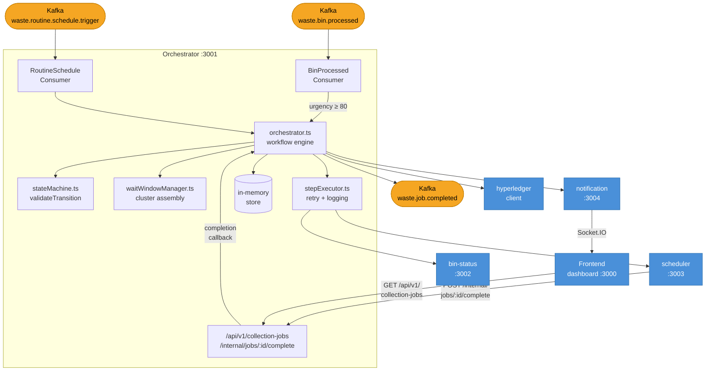
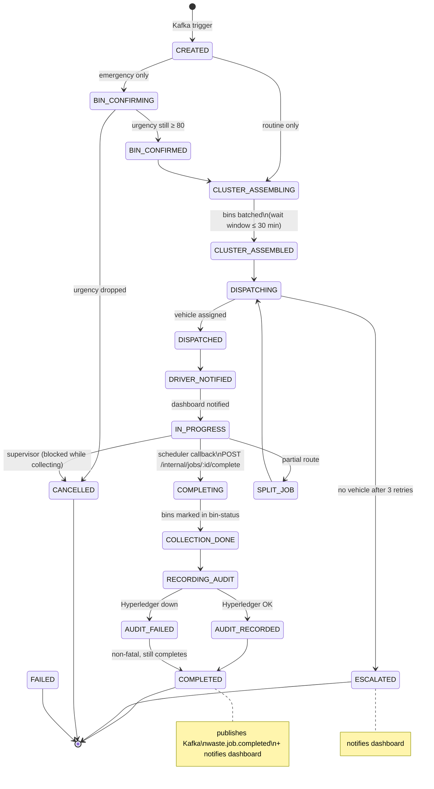
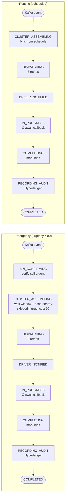

# Orchestrator Diagrams

## 1 — System Interactions

```mermaid
flowchart TD
    KA([Kafka\nwaste.bin.processed]):::kafka
    KB([Kafka\nwaste.routine.schedule.trigger]):::kafka
    KC([Kafka\nwaste.job.completed]):::kafka

    subgraph ORCH["Orchestrator  :3001"]
        C1[BinProcessed\nConsumer]
        C2[RoutineSchedule\nConsumer]
        OC[orchestrator.ts\nworkflow engine]
        SM[stateMachine.ts\nvalidateTransition]
        WW[waitWindowManager.ts\ncluster assembly]
        SE[stepExecutor.ts\nretry + logging]
        DB[(in-memory\nstore)]
        API["/api/v1/collection-jobs\n/internal/jobs/:id/complete"]
    end

    BS[bin-status\n:3002]:::svc
    SC[scheduler\n:3003]:::svc
    NT[notification\n:3004]:::svc
    HL[hyperledger\nclient]:::svc
    FE[Frontend\ndashboard :3000]:::svc

    KA --> C1
    KB --> C2
    C1 -- urgency ≥ 80 --> OC
    C2 --> OC
    OC --> SM
    OC --> WW
    OC --> SE
    OC --> DB
    SE --> BS
    SE --> SC
    OC --> NT
    OC --> HL
    OC --> KC
    API -- completion\ncallback --> OC
    SC -- POST /internal/\njobs/:id/complete --> API
    FE -- GET /api/v1/\ncollection-jobs --> API
    NT -- Socket.IO --> FE

    classDef kafka fill:#f5a623,color:#000,stroke:#c47d00
    classDef svc fill:#4a90d9,color:#fff,stroke:#2c6fad
```

---

## 2 — State Machine

```mermaid
stateDiagram-v2
    [*] --> CREATED : Kafka trigger

    CREATED --> BIN_CONFIRMING : emergency only
    CREATED --> CLUSTER_ASSEMBLING : routine only

    BIN_CONFIRMING --> BIN_CONFIRMED : urgency still ≥ 80
    BIN_CONFIRMING --> CANCELLED : urgency dropped

    BIN_CONFIRMED --> CLUSTER_ASSEMBLING

    CLUSTER_ASSEMBLING --> CLUSTER_ASSEMBLED : bins batched\n(wait window ≤ 30 min)

    CLUSTER_ASSEMBLED --> DISPATCHING

    DISPATCHING --> DISPATCHED : vehicle assigned
    DISPATCHING --> ESCALATED : no vehicle after 3 retries

    DISPATCHED --> DRIVER_NOTIFIED
    DRIVER_NOTIFIED --> IN_PROGRESS : dashboard notified

    IN_PROGRESS --> COMPLETING : scheduler callback\nPOST /internal/jobs/:id/complete
    IN_PROGRESS --> SPLIT_JOB : partial route
    IN_PROGRESS --> CANCELLED : supervisor (blocked while collecting)

    SPLIT_JOB --> DISPATCHING

    COMPLETING --> COLLECTION_DONE : bins marked in bin-status

    COLLECTION_DONE --> RECORDING_AUDIT

    RECORDING_AUDIT --> AUDIT_RECORDED : Hyperledger OK
    RECORDING_AUDIT --> AUDIT_FAILED : Hyperledger down

    AUDIT_RECORDED --> COMPLETED
    AUDIT_FAILED --> COMPLETED : non-fatal, still completes

    COMPLETED --> [*]
    ESCALATED --> [*]
    CANCELLED --> [*]
    FAILED --> [*]

    note right of ESCALATED : notifies dashboard
    note right of COMPLETED : publishes Kafka\nwaste.job.completed\n+ notifies dashboard
```

---

## 3 — Emergency vs Routine Side-by-Side

```mermaid
flowchart LR
    subgraph EMG["Emergency (urgency ≥ 80)"]
        direction TB
        e1([Kafka event]) --> e2[BIN_CONFIRMING\nverify still urgent]
        e2 --> e3[CLUSTER_ASSEMBLING\nwait window + scan nearby\nskipped if urgency ≥ 90]
        e3 --> e4[DISPATCHING\n3 retries]
        e4 --> e5[DRIVER_NOTIFIED]
        e5 --> e6[IN_PROGRESS\n⏳ await callback]
        e6 --> e7[COMPLETING\nmark bins]
        e7 --> e8[RECORDING_AUDIT\nHyperledger]
        e8 --> e9([COMPLETED])
    end

    subgraph RTN["Routine (scheduled)"]
        direction TB
        r1([Kafka event]) --> r2[CLUSTER_ASSEMBLING\nbins from schedule]
        r2 --> r3[DISPATCHING\n3 retries]
        r3 --> r4[DRIVER_NOTIFIED]
        r4 --> r5[IN_PROGRESS\n⏳ await callback]
        r5 --> r6[COMPLETING\nmark bins]
        r6 --> r7[RECORDING_AUDIT\nHyperledger]
        r7 --> r8([COMPLETED])
    end
```
